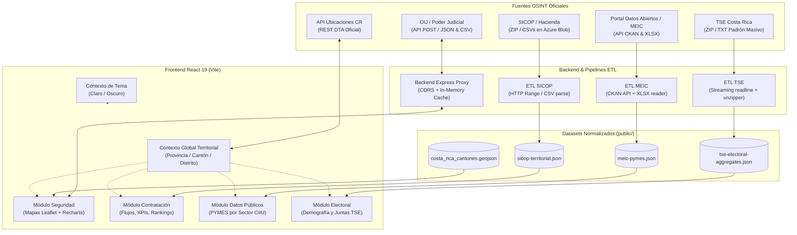

# Observatorio Territorial y de Inteligencia de Fuentes Abiertas (OSINT) de Costa Rica

Plataforma web interactiva para la consulta, fiscalización, análisis geoespacial y cruce territorial de información pública costarricense basada en metodologías de **Inteligencia de Fuentes Abiertas (OSINT)**.

---

## 1. Descripción del Problema y Objetivo de la Solución

### 1.1 Descripción del Problema

En Costa Rica, las instituciones públicas generan y publican una cantidad sustancial de datos abiertos relacionados con seguridad ciudadana, contratación pública, desarrollo productivo y demografía electoral. No obstante, estos datos presentan importantes barreras de acceso y fiscalización:

- **Fragmentación y Dispersión:** Cada entidad estatal administra su propio portal y repositorio de forma aislada (SICOP, OIJ, TSE, MEIC/CKAN), sin interoperabilidad directa entre ellos.
- **Heterogeneidad de Formatos y Mecanismos:** La información se publica en formatos diversos y dispares: APIs REST legadas basadas en peticiones HTTP POST con cargas codificadas, volcados CSV comprimidos en archivos ZIP de gran tamaño, hojas de cálculo en XLSX o archivos de texto plano masivos con millones de registros.
- **Ausencia de Correlación Territorial Unificada:** No existe una herramienta integrada que permita correlacionar estos conjuntos de datos bajo una misma **División Territorial Administrativa (DTA)** a nivel de provincia, cantón y distrito.
- **Opacidad en la Auditoría Ciudadana:** Dificultad para que la ciudadanía, periodistas de investigación y tomadores de decisiones puedan auditar en un solo punto geográfico cuánto gasta el Estado, qué delitos ocurren, cuántas empresas operan y cómo se distribuye la población electoral.

### 1.2 Objetivo de la Solución

Desarrollar una solución integral full-stack basada en técnicas **OSINT** que:

1. **Centralice y consolide** la información de múltiples fuentes oficiales del Estado costarricense.
2. **Normalice y estandarice** los datos heterogéneos contra la División Territorial Administrativa oficial de Costa Rica.
3. **Proporcione una experiencia visual moderna y responsiva**, con un selector territorial global sincronizado en tiempo real, mapas geoespaciales interactivos (Leaflet), analítica gráfica (Recharts) y soporte nativo para temas claro y oscuro.
4. **Implemente una arquitectura desacoplada y eficiente**, utilizando pipelines ETL optimizados (por streaming y lectura selectiva por rango de bytes) y un backend proxy en Express que resuelva restricciones de CORS y optimice tiempos de respuesta mediante caché en memoria.

---

## 2. Equipo de Trabajo y Responsables por Fuente OSINT

De acuerdo con la distribución de trabajo del proyecto (**4 Fuentes OSINT, 4 Integrantes, Un Mismo Territorio**):

| Fuente OSINT | Módulo Temático          | Entidad Oficial                                                                  | Integrante Responsable |
| ------------ | ------------------------ | -------------------------------------------------------------------------------- | ---------------------- |
| **SICOP**    | Contratación Pública     | Sistema Integrado de Compras Públicas / Ministerio de Hacienda                   | **Katheryn Méndez**    |
| **OIJ**      | Seguridad y Estadísticas | Organismo de Investigación Judicial / Poder Judicial                             | **Greilyn Esquivel**   |
| **MEIC**     | Datos Públicos           | Ministerio de Economía, Industria y Comercio / Portal Nacional de Datos Abiertos | **Krystel Salazar**    |
| **TSE**      | Población y Padrón       | Tribunal Supremo de Elecciones (Padrón Electoral Nacional)                       | **Angélica Ortíz**     |

---

## 3. Catálogo de Fuentes OSINT y Mecanismos de Consumo

### 3.1 Tabla Resumen de Fuentes

| Fuente                                        | Entidad Oficial                                 | Enlace Oficial                                                                                                                                                          | Responsable          | Formato / Protocolo                        | Mecanismo de Consumo                                                                                      |
| --------------------------------------------- | ----------------------------------------------- | ----------------------------------------------------------------------------------------------------------------------------------------------------------------------- | -------------------- | ------------------------------------------ | --------------------------------------------------------------------------------------------------------- |
| **Contratación Pública (SICOP)**              | Ministerio de Hacienda / RACSA                  | [Portal SICOP](https://www.sicop.go.cr/) · [Observatorio Compra Pública](https://www.observatoriocomprapublica.go.cr/descargas-sicop/)                                  | **Katheryn Méndez**  | CSV (delimitado `;`) en ZIP mensual / HTTP | Pipeline ETL selectivo Node.js (`HTTP Range requests`) sobre contenedor público Azure Blob                |
| **Seguridad y Estadísticas Policiales (OIJ)** | Organismo de Investigacion Judicial             | [Sitio Oficial OIJ](https://sitiooij.poder-judicial.go.cr/) · [Estadísticas Policiales](https://pjenlinea3.poder-judicial.go.cr/estadisticasoij/)                       | **Greilyn Esquivel** | REST JSON / CSV sobre HTTP POST            | Backend Proxy Express en tiempo real con caché en memoria (TTL 30 min) y reintentos ante fallos           |
| **Datos Públicos (MEIC - PYMES)**             | Portal Nacional de Datos Abiertos (CKAN / MEIC) | [Portal Datos Abiertos](https://datosabiertos.gob.go.cr/) · [Dataset PYMES](https://datosabiertos.gob.go.cr/dataset/lista-de-pymes-activas-empresas-activas-enero-2025) | **Krystel Salazar**  | API CKAN v3 (JSON) / XLSX                  | Pipeline ETL Node.js (`fetchMeicPymes.mjs`) que consulta metadatos en API CKAN, descarga y parsea el XLSX |
| **Población y Padrón (TSE)**                  | Tribunal Supremo de Elecciones                  | [Sitio Oficial TSE](https://www.tse.go.cr/) · [Descarga del Padrón](https://www.tse.go.cr/descarga_padron.htm)                                                          | **Angélica Ortíz**   | TXT delimitado por comas / ZIP             | Script ETL por streaming en TypeScript (`unzipper` + `readline`) para procesar 3.7M+ registros            |
| **División Territorial (DTA)**                | Instituto Geográfico Nacional (IGN)             | [API Ubicaciones CR](https://ubicaciones.paginasweb.cr/)                                                                                                                | Transversal          | REST JSON                                  | Cliente HTTP en tiempo real integrado en el selector territorial global y validadores ETL                 |
| **Servicios y Lugares (OSM)**                 | OpenStreetMap Foundation                        | [OpenStreetMap](https://www.openstreetmap.org/)                                                                                                                         | Planificado          | Overpass API / REST JSON                   | Consultas nominales geoespaciales por polígono territorial                                                |

---

### 3.2 Detalle Técnico de Consumo por Fuente

#### 1. Contratación Pública (SICOP) — Responsable: Katheryn Méndez

- **¿Por qué fue escogida?:** Permite auditar el gasto público del Estado costarricense, identificar proveedores adjudicados por zona y verificar la descentralización de las compras públicas.
- **Qué obtiene la aplicación:** Procedimientos de contratación, montos adjudicados en colones (CRC) y dólares (USD), instituciones compradoras, empresas adjudicatarias y su localización geográfica.
- **Endpoint / Origen:** Contenedor público Azure Blob del Observatorio de Compra Pública:
  `https://dlsaobservatorioprod.blob.core.windows.net/fs-synapse-observatorio-produccion/Zip/`
- **Mecanismo técnico:** Script ETL (`src/modules/procurement/etl/fetchSicop.mjs`). Realiza peticiones HTTP con encabezados `Range: bytes=...` para leer el directorio central del ZIP sin descargar el archivo completo de varios gigabytes. Extrae exclusivamente `ProcedimientoAdjudicacion.csv`, `InstitucionesRegistradas.csv` y `Proveedores.csv`, normaliza las ubicaciones contra la DTA y genera `public/sicop/sicop-territorial.json`.

#### 2. Seguridad y Estadísticas Policiales (OIJ) — Responsable: Greilyn Esquivel

- **¿Por qué fue escogida?:** Proporciona la radiografía oficial de criminalidad en Costa Rica para análisis de riesgo, prevención y evaluación de seguridad ciudadana por territorio.
- **Qué obtiene la aplicación:** Incidencia de delitos penales (homicidios, asaltos, hurtos, robos, tachas y robos de vehículos), distribución temporal mensual, tipología y modalidades delictivas por cantón y distrito.
- **Endpoints:**
  - `POST https://pjenlinea3.poder-judicial.go.cr/estadisticasoij/Home/obtenerCategorias` (totales por delito)
  - `POST https://pjenlinea3.poder-judicial.go.cr/estadisticasoij/Home/obtenerTemporales` (distribución mensual)
  - `POST https://pjenlinea3.poder-judicial.go.cr/estadisticasoij/Home/obtenerDatosDescargas` (detalle de registros en formato CSV)
- **Mecanismo técnico:** Servidor proxy Express (`server/services/oijService.ts`). Transforma los identificadores de la DTA al formato de codificación del OIJ (`TC_Provincias`, `TC_Cantones`, `TC_Distritos`), gestiona las peticiones POST con reintentos automáticos (`fetchWithRetry`) y almacena los resultados en una caché en memoria (TTL de 30 minutos) para optimizar el rendimiento y evitar sobrecarga al portal judicial.

#### 3. Datos Públicos Nacionales (MEIC / PYMES) — Responsable: Krystel Salazar

- **¿Por qué fue escogida?:** Permite mapear la densidad empresarial formal, el emprendimiento y la concentración productiva en cada región del país.
- **Qué obtiene la aplicación:** Padrón de empresas y PYMES registradas con condición activa, clasificación por tamaño (Micro, Pequeña, Mediana) y sector de actividad económica según el clasificador internacional CIIU.
- **Endpoints / Origen:**
  - API CKAN: `https://datosabiertos.gob.go.cr/api/3/action/package_show?id=lista-de-pymes-activas-empresas-activas-enero-2025`
  - Descarga del recurso oficial en formato `.xlsx`.
- **Mecanismo técnico:** Pipeline ETL (`src/modules/publicData/etl/fetchMeicPymes.mjs`). Consulta dinámicamente la API de CKAN para obtener el recurso más reciente, procesa el archivo Excel en memoria mediante streaming con `xlsxReader.mjs`, homologa los nombres de cantones y distritos con la DTA y consolida la estructura en `public/meic-pymes/meic-pymes.json`.

#### 4. Población y Padrón Electoral (TSE) — Responsable: Angélica Ortíz

- **¿Por qué fue escogida?:** Es la fuente demográfica oficial más actualizada de personas mayores de edad con derecho al voto y distribución de centros de sufragio a nivel nacional.
- **Qué obtiene la aplicación:** Cantidad de electores inscritos, proporción demográfica por sexo (hombres/mujeres), desagregación de electores nacionales vs. naturalizados y cobertura de juntas receptoras de votos por distrito electoral.
- **Origen de datos:** Archivo ZIP oficial descargable desde `https://www.tse.go.cr/descarga_padron.htm` conteniendo `distelec.txt` (catálogo distrital y código electoral) y `PADRON_COMPLETO.txt` (más de 3.7 millones de registros individuales).
- **Mecanismo técnico:** Script ETL en TypeScript (`scripts/process-tse-electoral-roll.ts`). Emplea un flujo de streaming con `unzipper` e interfaces de `readline` de Node.js, procesando línea por línea sin saturar la memoria RAM. Genera agregados estadísticos anonimizados en `public/data/tse-electoral-aggregates.json`.

---

## 4. Tecnologías y Arquitectura General

### 4.1 Stack Tecnológico

- **Frontend:** React 19, TypeScript (modo estricto).
- **Backend / Proxy:** Node.js, Express 5, TSX.
- **Empaquetador y Servidor de Desarrollo:** Vite 8.
- **Enrutamiento:** React Router DOM v7.
- **Mapas y Visualización Geoespacial:** Leaflet, React-Leaflet.
- **Analítica y Gráficos:** Recharts.
- **Iconografía:** Lucide React.
- **Estilos:** Vanilla CSS moderno con Design Tokens (variables CSS nativas, temas claro/oscuro adaptativos).
- **Procesamiento de Datos:** `unzipper`, `csv-parse`, streaming nativo de Node.js.

### 4.2 Diagrama de Arquitectura



---

### 4.3 Estructura del Repositorio

```text
Sistema_OSINT/
├── public/                       # Datasets procesados y archivos estáticos
│   ├── data/                     # GeoJSON cantonal y agregados electorales (TSE)
│   ├── meic-pymes/               # Dataset territorializado de PYMES (MEIC)
│   └── sicop/                    # Dataset consolidado de contratación pública (SICOP)
├── scripts/                      # Scripts de procesamiento masivo por streaming
│   └── process-tse-electoral-roll.ts # Procesamiento del padrón electoral TSE
├── server/                       # Backend en Express (Servidor proxy para CORS y caché)
│   ├── index.ts                  # Punto de entrada del servidor Express
│   ├── routes/                   # Rutas del API interna (/api/security)
│   ├── services/                 # Lógica de consumo OIJ con reintentos y caché
│   └── utils/                    # Parser de CSV y transformadores
├── src/                          # Código fuente del Frontend
│   ├── components/
│   │   ├── common/               # Componentes UI reutilizables (Card, Badge, Dropdown, TerritorialSelector)
│   │   └── layout/               # Layout maestro, Navbar, Footer y conmutador de tema
│   ├── constants/                # Rutas, catálogos y metadatos de fuentes oficiales
│   ├── context/                  # Contextos globales de React (TerritoryContext y ThemeContext)
│   ├── hooks/                    # Hooks personalizados (useLocation, useTheme)
│   ├── modules/                  # Módulos funcionales desacoplados
│   │   ├── procurement/          # Contratación Pública (SICOP) - ETL, tipos, servicios y vistas
│   │   ├── security/             # Seguridad (OIJ) - Mapas interactivos, KPIs y analítica
│   │   ├── publicData/           # Datos Públicos (MEIC) - ETL, clasificador CIIU y visualización
│   │   ├── electoral/            # Estadísticas Electorales (TSE) - Demografía y juntas receptoras
│   │   └── places/               # Servicios y Lugares (OpenStreetMap / Overpass)
│   ├── pages/                    # Vistas principales vinculadas a React Router
│   ├── services/                 # Clientes HTTP compartidos (locationService.ts)
│   ├── styles/                   # Sistema de diseño con Design Tokens y CSS Vanilla
│   ├── types/                    # Definiciones TypeScript globales
│   ├── App.tsx                   # Enrutador principal de la aplicación
│   └── main.tsx                  # Punto de entrada de Vite
├── .env.example                  # Plantilla de variables de entorno documentada
├── package.json                  # Dependencias y scripts del proyecto
├── tsconfig.json                 # Configuración de TypeScript estricto
└── vite.config.ts                # Configuración de Vite
```

---

## 5. Requisitos y Guía de Ejecución

### 5.1 Requisitos Previos

- **Node.js:** Versión 18 o superior (probado en Node.js v20 / v22 / v24).
- **npm:** Versión 9 o superior.

### 5.2 Pasos de Instalación y Ejecución

1. **Clonar el repositorio y ubicarse en el directorio:**

   ```bash
   git clone <URL_DEL_REPOSITORIO>
   cd Sistema_OSINT
   ```

2. **Instalar las dependencias:**

   ```bash
   npm install
   ```

3. **(Opcional) Configurar variables de entorno:**

   ```bash
   cp .env.example .env
   ```

4. **Ejecutar en modo de desarrollo:**

   ```bash
   npm run dev
   ```

   > Este comando inicia de forma concurrente:
   >
   > - **Frontend (Vite):** `http://localhost:5173`
   > - **Backend / Proxy (Express):** `http://localhost:3001`

5. **Compilar para producción y verificación de tipos TypeScript:**

   ```bash
   npm run build
   ```

6. **Previsualizar la compilación de producción:**
   ```bash
   npm run preview
   ```

---

### 5.3 Scripts ETL para Regeneración de Datasets (Opcional)

El repositorio **ya incluye los datos normalizados en la carpeta `public/`**, por lo que la aplicación funciona inmediatamente tras la instalación sin necesidad de ejecutar los ETLs. Si se desea actualizar o regenerar los datos desde las fuentes oficiales:

- **ETL Padrón Electoral (TSE):**
  ```bash
  npm run etl:tse -- <ruta-al-archivo-zip-del-padron>
  ```
- **ETL Contratación Pública (SICOP):**
  ```bash
  node src/modules/procurement/etl/fetchSicop.mjs
  ```
  _(Opcional: `--meses=36` o `--desde=202401 --hasta=202412`)_
- **ETL Datos Públicos PYMES (MEIC):**
  ```bash
  node src/modules/publicData/etl/fetchMeicPymes.mjs
  ```

---

## 6. Variables de Entorno

Al tratarse de una solución basada en **fuentes de datos abiertos estatales (OSINT)**, el sistema **no requiere credenciales privadas, tokens de pago ni llaves API secretas**.

Todas las variables son opcionales y cuentan con valores por defecto para operar sin configuración previa:

| Variable              | Tipo              | Valor por Defecto                         | Descripción                                                                             |
| --------------------- | ----------------- | ----------------------------------------- | --------------------------------------------------------------------------------------- |
| `PORT`                | Número            | `3001`                                    | Puerto en el que escucha el servidor backend/proxy en Express.                          |
| `VITE_API_BASE_URL`   | String (URL)      | `http://localhost:3001`                   | URL base del backend Express consumida por el cliente Vite.                             |
| `SICOP_CONTAINER_URL` | String (URL)      | Contenedor oficial Azure Blob de Hacienda | Permite redirigir el ETL de SICOP a un contenedor espejo si Hacienda actualiza el host. |
| `SICOP_MESES`         | Número            | `24`                                      | Cantidad de meses hacia atrás a procesar en el ETL de compras públicas.                 |
| `SICOP_DESDE`         | String (`YYYYMM`) | `null`                                    | Mes inicial para rango personalizado de extracción SICOP.                               |
| `SICOP_HASTA`         | String (`YYYYMM`) | `null`                                    | Mes final para rango personalizado de extracción SICOP.                                 |

---

## 7. Características Destacadas de la Plataforma

- **Selector Territorial Persistente:** Permite filtrar toda la analítica de la plataforma por Provincia, Cantón y Distrito mediante `TerritoryContext` sincronizado con la API oficial de la DTA.
- **Diseño Institucional con Soporte Dark/Light Mode:** Sistema de tokens CSS con paleta inspirada en la biodiversidad y sobriedad costarricense, adaptativo a las preferencias del sistema y persistente en `localStorage`.
- **Cero Dependencia de Credenciales:** Acceso transparente a datos abiertos asegurando reproducibilidad y facilidad de despliegue.
- **Rendimiento Optimizado:** Uso de streaming para archivos masivos y caché en memoria para llamadas a servicios externos con reintentos inteligentes.
